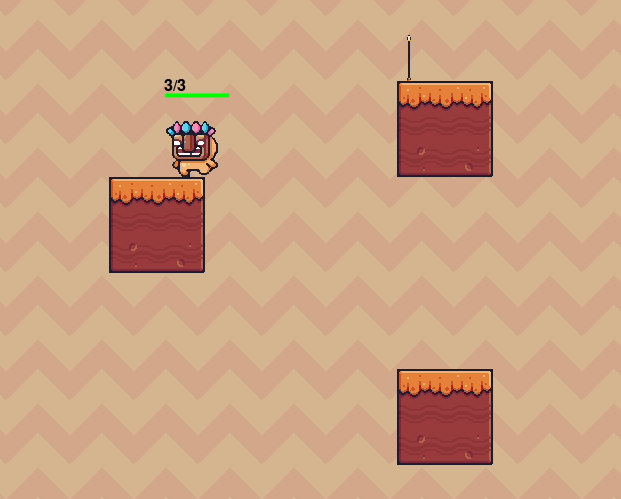

&nbsp;&nbsp;&nbsp;&nbsp;&nbsp;&nbsp;&nbsp;&nbsp;Jump Quest Reborn is a first attempt at a pure python implementation of a 2D side-scroller Jump Quest – a popular subgame found in many classic side-scroller 2D MMORPGs such as MapleStory. 

&nbsp;&nbsp;&nbsp;&nbsp;&nbsp;&nbsp;&nbsp;&nbsp;In a jump quest, the goal is to navigate a 2D character to the top of the map, where a finishing line awaits. Besides trying to solve for a viable path upwards, the player also needs to navigate dangerous traps. 

|  |
|:------------------------------------------:|

&nbsp;&nbsp;&nbsp;&nbsp;&nbsp;&nbsp;&nbsp;&nbsp;The starter code and game assets for this game are based on the 2D platformer tutorial created by [@TechwithTim](https://www.youtube.com/@TechWithTim), and the starter code can be found at the following [GitHub repository](https://www.youtube.com/watch?v=B6DrRN5z_uU).

